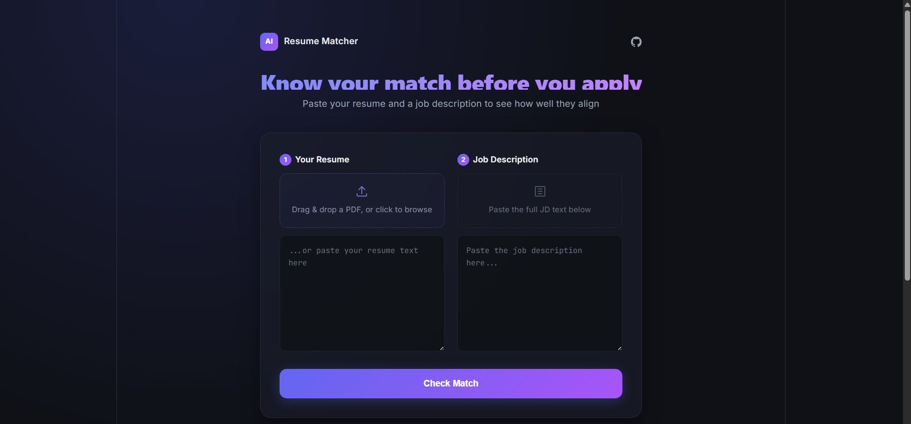

# AI Resume Matcher

An AI-powered tool that scores how well a resume matches a job description, highlights missing keywords, and generates tailored improvement suggestions — built to speed up the job application tailoring process.

🔗 **Live demo:** [ai-resume-matcher-eta-nine.vercel.app](https://ai-resume-matcher-eta-nine.vercel.app/)



## Features

- 📄 **PDF upload with drag-and-drop** — extracts resume text automatically, no manual copy-pasting required
- 🎯 **AI-powered match scoring** — get a 0-100% compatibility score between your resume and any job description
- 🔑 **Missing keyword detection** — instantly see which important JD terms are absent from your resume
- 💡 **Tailored suggestions** — AI-generated, specific bullet point improvements based on the actual job description
- 🎨 **Polished, responsive UI** — dark theme, animated score visualization, drag-and-drop support

## Tech Stack

**Frontend:** React (Vite), CSS
**Backend:** Node.js, Express
**AI:** Google Gemini API
**File handling:** Multer, pdf-parse
**Deployment:** Vercel (frontend), Render (backend)

## How It Works

1. User uploads a resume (PDF) or pastes resume text
2. User pastes a job description
3. Backend extracts PDF text (if uploaded) using `pdf-parse`
4. Backend sends both texts to Google's Gemini API with a structured prompt
5. Gemini returns a match score, missing keywords, and tailored suggestions
6. Frontend displays results with an animated score ring and formatted suggestions

## Running Locally

**Backend:**
```bash
cd backend
npm install
# Add your GEMINI_API_KEY to a .env file
node server.js
```

**Frontend:**
```bash
cd frontend
npm install
# Add VITE_API_URL=http://localhost:5000 to a .env file
npm run dev
```

## Known Limitations

- Backend runs on Render's free tier, which spins down after inactivity — first request after idle time may take 20-30 seconds while the server wakes up (a "cold start")
- Currently supports single-page PDF resumes best; very long/complex PDFs may extract with minor formatting loss

## Author

**Kasthuri M**
[LinkedIn](https://www.linkedin.com/in/kasthuri-m-001840256) · [GitHub](https://github.com/MKasthuriMohankumar)

## License

MIT — see [LICENSE](./LICENSE)